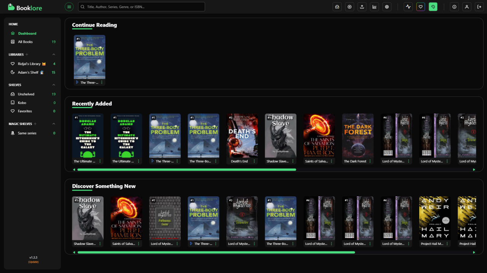
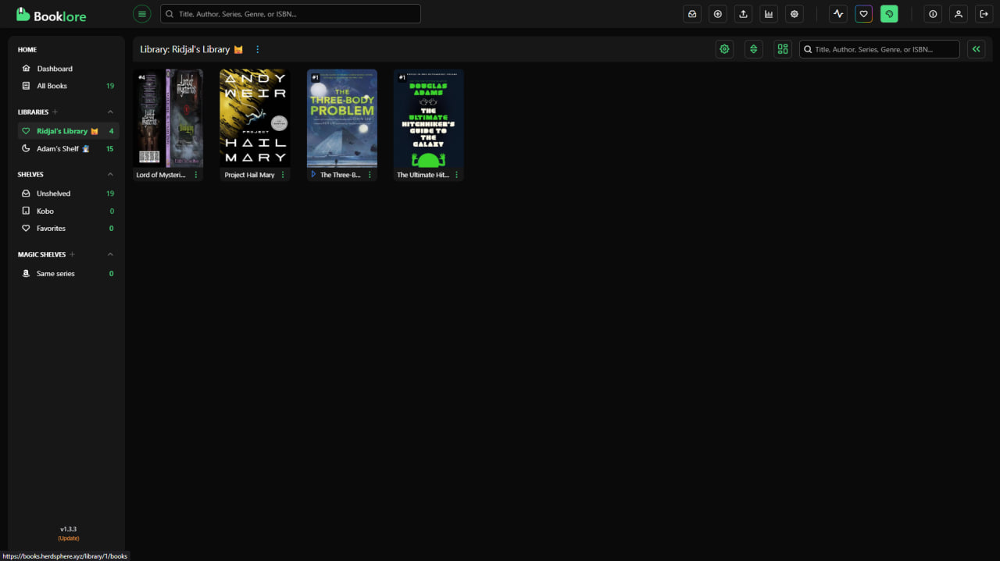
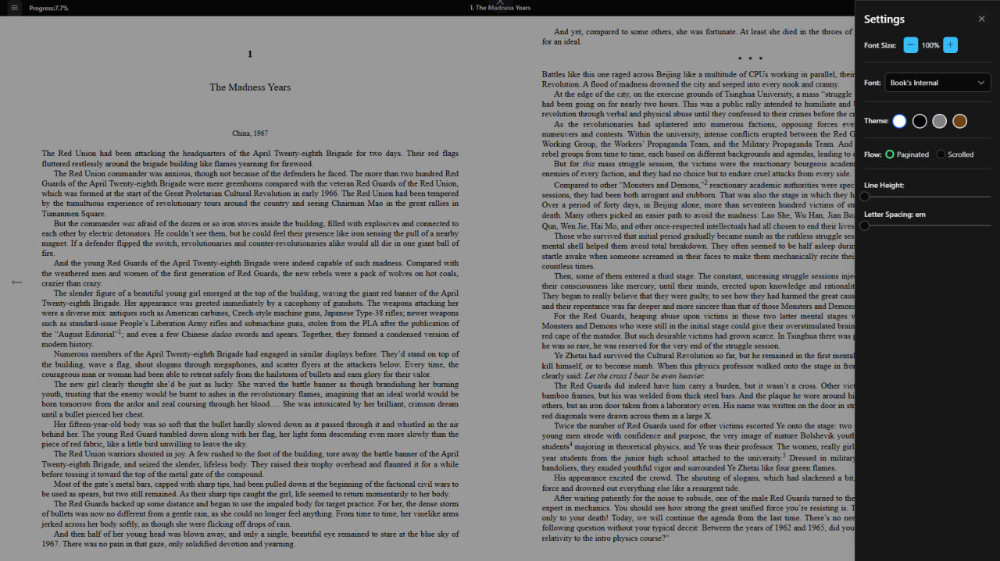

# 📚 Self-Hosted BookLore on Google Cloud VPS with Docker

## 📖 Pendahuluan

**BookLore** adalah aplikasi open-source untuk mengelola koleksi buku digital (EPUB, PDF, komik). Aplikasi ini menyediakan antarmuka web modern untuk membaca, mengatur, dan berbagi buku dengan beberapa pengguna.

BookLore dapat dibandingkan dengan layanan komersial seperti Goodreads atau Google Play Books, namun dengan keunggulan utama:

✅ **Self-hosted** → dijalankan di server milik sendiri  
✅ **Gratis & open-source**  
✅ **Privasi penuh** (data tidak dikirim ke pihak ketiga)

## 🔧 Prasyarat

Sebelum memulai, pastikan sudah menyiapkan:

- Akun Google Cloud & sebuah VM instance (contoh: e2-medium, Ubuntu 22.04, 2 vCPU, 4 GB RAM)
- IP publik static (agar domain/DNS tidak berubah)
- (Opsional) Domain yang diarahkan ke IP VPS (misalnya via Cloudflare)

## ⚡ Instalasi

### 🚀 Quick Install (Rekomendasi)

Install BookLore dengan **satu perintah**! Script ini akan otomatis:

✅ Update sistem  
✅ Install Docker & Docker Compose  
✅ Setup folder & konfigurasi  
✅ Generate password aman  
✅ Jalankan aplikasi

**Cara pakai:**

```bash
curl -fsSL https://raw.githubusercontent.com/chairulridjaal/booklore-vps/main/install-booklore.sh | bash
```

Atau download dulu, lalu jalankan:

```bash
wget https://raw.githubusercontent.com/chairulridjaal/booklore-vps/main/install-booklore.sh
chmod +x install-booklore.sh
./install-booklore.sh
```

Setelah instalasi selesai, akses BookLore di:
```
http://<VPS_IP>:6060
```

### 📖 Instalasi Manual

### 1. Update VPS

```bash
sudo apt update && sudo apt upgrade -y
```

### 2. Install Docker & Docker Compose

```bash
curl -fsSL https://get.docker.com | sh
sudo apt install docker-compose-plugin -y
```

### 3. Siapkan Folder Project

```bash
mkdir ~/booklore && cd ~/booklore
```

### 4. Buat File docker-compose.yml

Isi dengan konfigurasi berikut:

```yaml
services:
  booklore:
    image: booklore/booklore:latest
    container_name: booklore
    environment:
      - TZ=Asia/Jakarta
      - DATABASE_URL=jdbc:mariadb://mariadb:3306/booklore
      - DATABASE_USERNAME=booklore
      - DATABASE_PASSWORD=your_secure_password
      - BOOKLORE_PORT=6060
    depends_on:
      mariadb:
        condition: service_healthy
    ports:
      - "6060:6060"
    volumes:
      - ./data:/app/data
      - ./books:/books
      - ./bookdrop:/bookdrop
    restart: unless-stopped

  mariadb:
    image: lscr.io/linuxserver/mariadb:11.4.5
    container_name: mariadb
    environment:
      - MYSQL_ROOT_PASSWORD=super_secure_root_pw
      - MYSQL_DATABASE=booklore
      - MYSQL_USER=booklore
      - MYSQL_PASSWORD=your_secure_password
    volumes:
      - ./mariadb:/config
    restart: unless-stopped
    healthcheck:
      test: ["CMD", "mariadb-admin", "ping", "-h", "localhost"]
      interval: 5s
      timeout: 5s
      retries: 10
```

### 5. Jalankan BookLore

```bash
docker compose up -d
```

### 6. Akses Aplikasi

**Via IP VPS:**

```
http://<VPS_IP>:6060
```

**Via domain (contoh dengan subdomain):**

```
https://book.herdsphere.xyz
```

## 📷 Screenshot

Berikut beberapa tampilan antarmuka BookLore:

### 🏠 Homepage

Halaman utama menampilkan koleksi buku yang tersedia dengan tampilan grid yang rapi dan modern.



### 📚 User Library

Tampilan perpustakaan pengguna untuk mengelola koleksi buku pribadi dengan berbagai opsi filter dan sorting.



### 📋 Book Metadata

Detail metadata lengkap untuk setiap buku, termasuk informasi penulis, penerbit, rating, dan deskripsi yang diambil otomatis dari berbagai sumber.


### 📖 E-Reader

Built-in e-reader untuk membaca buku langsung di browser dengan tampilan yang nyaman dan berbagai opsi kustomisasi.



## ✅ Fitur Utama

👥 **Multi-user management** dengan role (Admin, User, Guest)  
📖 **Built-in reader** untuk EPUB, PDF, dan komik (CBZ/CBR)  
🔍 **Metadata otomatis** dari Goodreads, Google Books, Amazon  
📲 **OPDS support** (bisa connect ke e-reader apps seperti KOReader / Moon+ Reader)  
📤 **Bookdrop folder** untuk import otomatis  
🔑 **Integrasi login** via OIDC (Google/Auth0/Authentik/Authelia)

## 📊 Perbandingan dengan Layanan Komersial

| Fitur               | Goodreads / Google Play Books  | BookLore                         |
| ------------------- | ------------------------------ | -------------------------------- |
| **Hosting**         | Cloud, pihak ketiga            | Self-hosted (VPS/Server sendiri) |
| **Biaya**           | Gratis, tapi data dijual iklan | Gratis & open source             |
| **Privasi**         | Data dikumpulkan               | Data sepenuhnya di server kita   |
| **Multi-user**      | Terbatas                       | Ada multi-user & role            |
| **Built-in reader** | Ya                             | Ya                               |
| **OPDS**            | Tidak                          | Ya                               |

## 🎓 Kesimpulan

BookLore adalah solusi alternatif open-source untuk manajemen e-book pribadi.

Dibandingkan layanan komersial, keunggulan utamanya ada pada privasi, kendali penuh, dan gratis.

Cocok untuk dipakai secara pribadi maupun bersama tim/keluarga.

## 👨‍💻 Anggota Kelompok

- Mochamad Chairulridjal Nurvirki
- Ghiffari Bravia Hisham
- Adam Naufal
- Pangeran Sunday Marcellino Putra Sopar Hutapea

---

## 📝 License

This project is licensed under the MIT License - see the [LICENSE](LICENSE) file for details.
